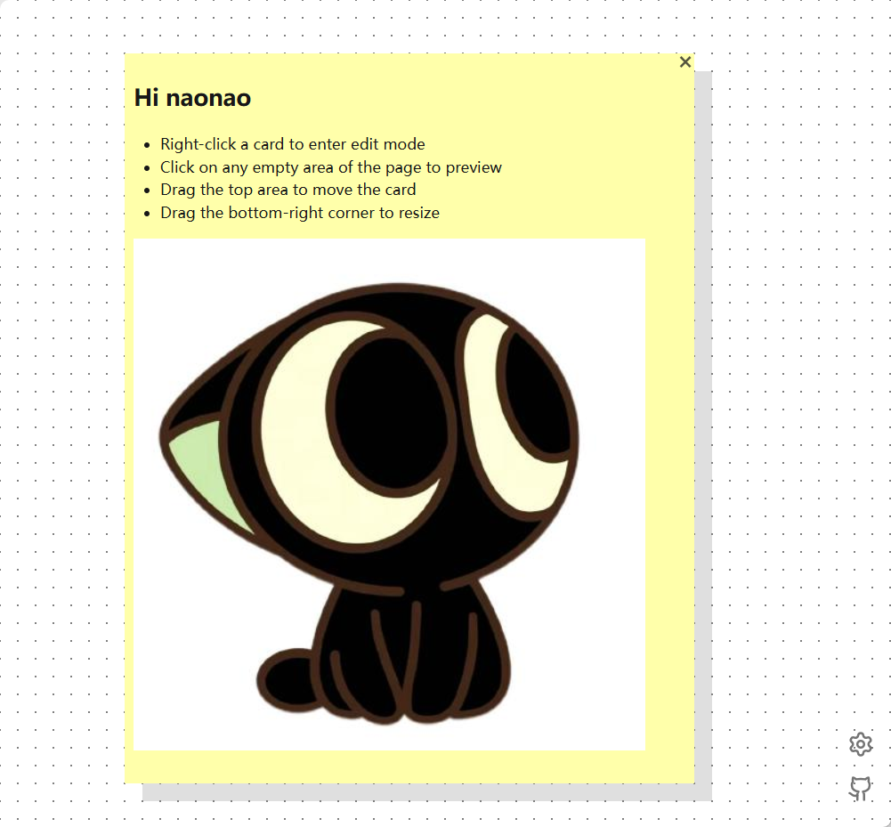

# [Sticky Board](https://sticky-web.netlify.app/)

[English](./README.md) | [中文](./README-zh.md)

一个简洁优雅的网页便签板，支持拖拽操作、网格对其和 Markdown 语法。

所有数据仅保存在本地，无需账号，无需同步，打开即用。

## ✨ 特性

- 🔒 **本地存储** – 所有数据仅存储在浏览器中
- 📄 **Markdown** – 支持使用 Markdown 语法编写内容并预览
- 🖼️ **粘贴图片** – 支持从剪贴板粘贴图片到 Markdown（单张限制 500KB）
- 📐 **网格对齐** – 移动卡片或调整大小自动吸附到网格
- 💾 **自动保存** – 所有修改都会自动保存
- 📤 **导入/导出** – 支持便签与粘贴图片一起导入/导出为 JSON
- 🌤️ **Sunny 主题** – 可选的动态树叶光影覆盖层
- 🌓 **深色模式** – 自动跟随系统主题
- 🌍 **多语言** – 根据浏览器语言自动切换中英文

## 🤝 贡献

欢迎提交 Issue 和 Pull Request。

## 🔮 规划

- [ ] 自定义便签颜色
- [ ] 标签 / 分组
- [x] 便签导入 / 导出
- [x] 多语言支持
- [ ] 快捷键操作
- [ ] 多选与批量操作
- [ ] 撤销 / 重做
- [ ] 云端同步

## 📝 License

MIT License，详见 [LICENSE](/LICENSE)

---

Made with ❤️ by qzda

