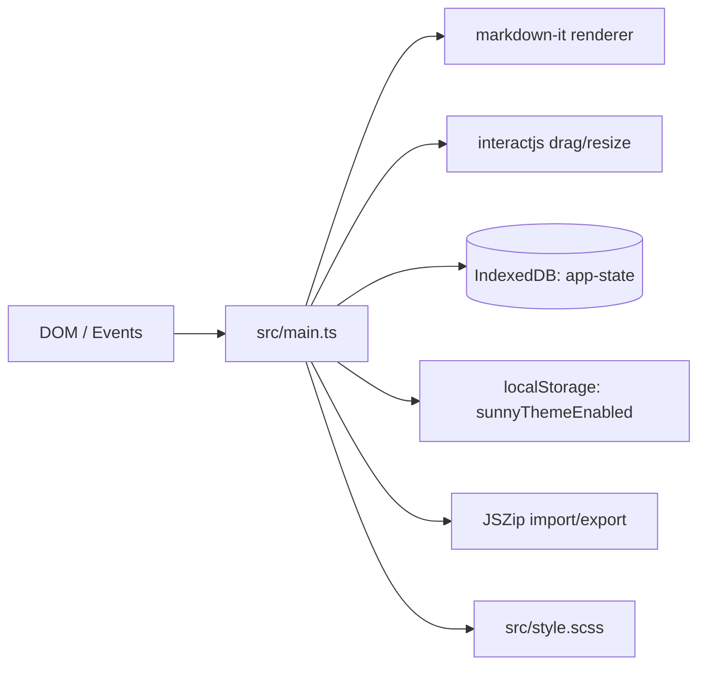
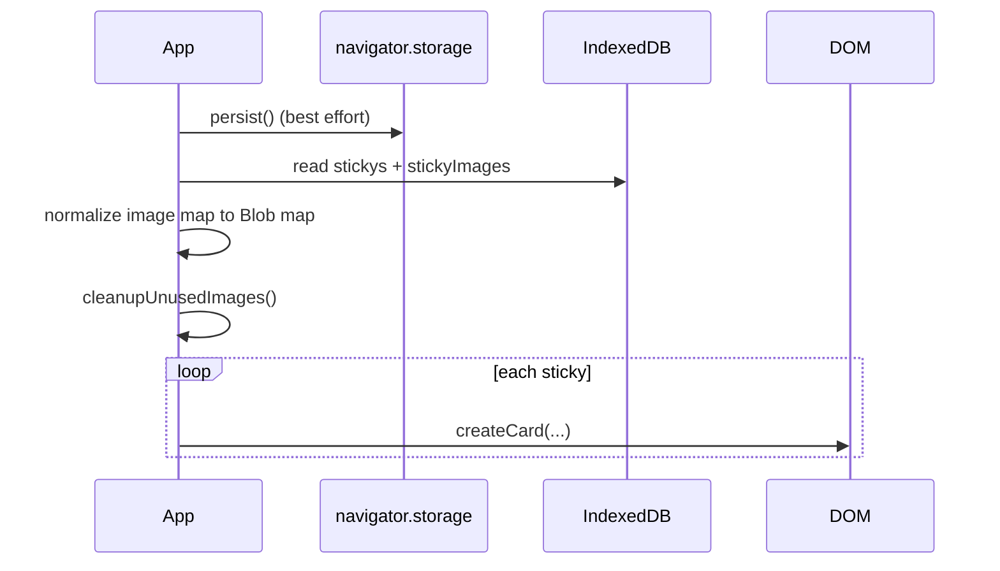
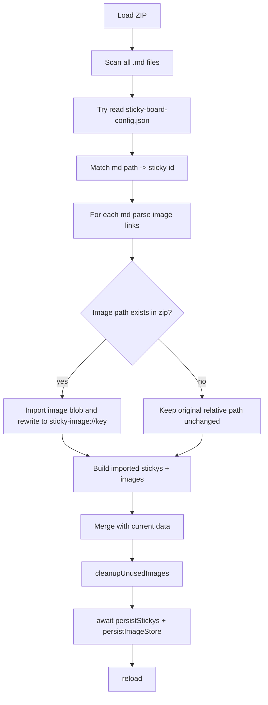

# Sticky Board Architecture

This document reflects the current implementation in `src/main.ts` and `src/style.scss`.
It is written so an engineer (or AI) can rebuild the app behavior with minimal ambiguity.

## 1. System Overview

Sticky Board is a browser-only sticky-note app with:

- Markdown notes (edit + preview)
- Drag/resize interactions (grid-snapped)
- Pasted image support (Blob storage)
- IndexedDB persistence for notes/images
- ZIP import/export (`.md + images + sticky-board-config.json`)
- Timeline layout mode
- Optional Sunny visual theme (video overlay)

No backend, no user account, no remote sync.

## 2. Runtime Architecture



## 3. Data Model

```ts
type Sticky = {
  x: number;
  y: number;
  width: number;   // rem
  height: number;  // rem
  zIndex: number;
  text: string;    // markdown source
};

type Stickys = Record<string, Sticky>;
```

In-memory stores:

- `stickys: Stickys`
- `imageStore: Record<string, Blob>`
- `imageUrlCache: Map<string, string>` (Object URL cache for rendering)
- `cardElementMap: Map<string, HTMLDivElement>`

Image reference format in markdown:

- ``

Image key convention:

- `[stickyID]-[imageID]`

## 4. Persistence Model

### 4.1 IndexedDB

- DB: `sticky-board-db`
- Version: `1`
- Store: `app-state` (`keyPath: key`)
- Keys:
  - `stickys`
  - `stickyImages`

Persisted values:

- `stickys` => `Stickys`
- `stickyImages` => `Record<string, Blob>`

### 4.2 localStorage

Only setting key is stored in localStorage:

- `sunnyThemeEnabled`

No localStorage->IndexedDB migration remains in current code.

## 5. Startup Sequence



Key function: `initializeState()`.

## 6. Rendering Pipeline

### 6.1 Markdown Rendering

Engine: `markdown-it` with:

- `html: true`
- `linkify: true`
- `breaks: true`

Custom rules:

- Link rule: forces `target="_blank"` + `rel="noopener noreferrer"`
- Image rule:
  - If src starts with `sticky-image://`, lookup `imageStore[key]`
  - Convert Blob -> Object URL (cached)
  - If missing image, fallback alt to `[missing image]`

### 6.2 Card Modes

- Edit mode: `textarea` visible
- Preview mode: `.preview` visible (HTML from markdown)

Global click behavior:

- Click blank area (`#root` / `body`) => all cards switch to preview
- On that same blank click, run `cleanupUnusedImages()`

### 6.3 Image Fullscreen Preview

- Clicking image inside preview opens modal overlay
- Close by background click or `Escape`

## 7. Interaction Model

### 7.1 Create Card by Dragging Empty Canvas

- `mousedown` on `#root` starts draw mode (only if target is root itself)
- `mousemove` shows dashed shadow box
- `mouseup` creates card if >= `160px x 160px`
- Dimensions are converted to rem via `/16`
- During creation drag, `user-select` is disabled globally to prevent text selection artifacts

### 7.2 Move/Resize Cards

Using `interactjs`:

- Resize handle: `.resize`
- Restrict edges to parent
- Drag snap: `16px` grid
- Drag restriction: within `#root`
- On drag/resize start: `bringCardToFront()`
- On move/end: persist geometry (`x/y/width/height`)

### 7.3 Edit Entry

- Right-click card enters edit mode (except delete button/resize handle)
- Left click card brings it to top z-index

## 8. Timeline Layout Mode

Toggle source: layout button in settings.

When enabled (`layout-timeline` class):

- Cards are grouped by day from ID timestamp prefix
- Ordered newest-first
- Timeline panel renders `date marker + card row`
- Cards become `layout-docked` and arranged in flow layout
- Root background dot pattern is removed
- Timeline hint text is shown at top

Special interaction in timeline mode:

- Double-click any card:
  - exit timeline mode
  - bring that card to top
  - move it to viewport center (snapped to 16px grid)

## 9. Image Lifecycle

### 9.1 Paste

Inside textarea `paste` handler:

1. Extract first `image/*` clipboard item
2. Enforce size limit (`MAX_PASTED_IMAGE_SIZE = 20MB`)
3. Create image key and save Blob to `imageStore`
4. Persist image store
5. Insert markdown ``
6. Persist sticky text

### 9.2 Cleanup Strategy

`cleanupUnusedImages()` parses all markdown text for `sticky-image://` keys.

- Unreferenced image keys are deleted from `imageStore`
- Corresponding object URLs are revoked
- Image store is persisted if changed

Cleanup is intentionally triggered on blank-area click (preview switch), not on every edit keystroke.

## 10. ZIP Export Format

Trigger: Export button.

File name:

- `sticky-board-{Date.now()}.zip`

Archive contents:

- `/{id}.md` for each sticky
- `/images/{asset-id}.{ext}` for pasted images
- `/sticky-board-config.json`

`sticky-board-config.json` shape:

```json
{
  "id1": { "x": 0, "y": 0, "width": 20, "height": 10, "zIndex": 1, "path": "./id1.md" },
  "id2": { "x": 16, "y": 16, "width": 20, "height": 10, "zIndex": 2, "path": "./id2.md" }
}
```

Export markdown rewrite:

- `sticky-image://<key>` => `./images/<asset-id>.<ext>`

Goal: extracted folder can be opened in VS Code and markdown preview can load images through relative paths.

## 11. ZIP Import Behavior

Trigger: Import button (accepts `.zip`).



ID resolution rules:

1. Try config path mapping (`path` in config)
2. If no mapping, generate new ID from `Date.now()` base, incremented by `+100ms` per new file to avoid collisions

Default layout for md without config:

- Slight offsets: `(10,10)`, `(20,20)`, `(30,30)` ...
- Width/height defaults to `20/10`
- zIndex increments from current max

If image file referenced by relative path is missing in zip:

- Leave original markdown image path untouched

## 12. Settings Panel

Settings items:

- Sunny toggle
- Export button
- Import button
- Layout toggle icon
- Settings icon
- GitHub link

Expand/collapse behavior:

- Staggered pop-in/pop-out animation
- Bottom item appears first
- Most actions auto-collapse settings after click/change

## 13. Theming and Visual Layers

- Sunny overlay uses `leaves.mp4` as fixed full-screen video
- Playback is paused/resumed by visibility state
- Reduced motion media query disables overlay
- Card/scrollbar/timeline styles are in `src/style.scss`

## 14. Key Invariants

- `sticky-image://` is the only internal image URI scheme
- `imageStore` must be Blob-based in memory and IndexedDB
- `bringCardToFront()` is the canonical z-index elevation path
- Timeline mode and free-layout mode are mutually exclusive render states
- Import persistence must finish (`await`) before page reload

## 15. Rebuild Order (Recommended)

1. Core types and i18n text table
2. IndexedDB adapter (`open/read/write`)
3. Markdown renderer overrides
4. Card factory + edit/preview toggle
5. Paste image pipeline + image URI scheme
6. Drag/create/move/resize interactions
7. Settings panel + sunny theme + layout mode
8. Image cleanup and object URL lifecycle
9. ZIP export
10. ZIP import (path mapping, fallback IDs/default layout)
11. Startup bootstrap and final integration checks
